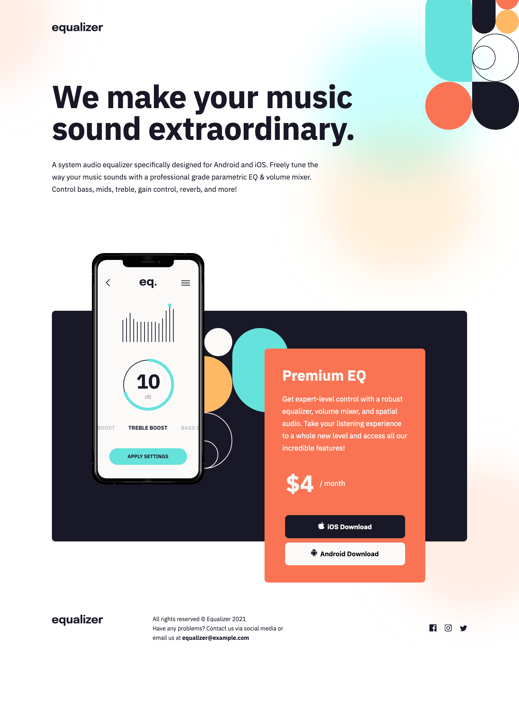

# Equalizer landing page

## Table of contents

- [Overview](#overview)
  - [The challenge](#the-challenge)
  - [Screenshot](#screenshot)
  - [Links](#links)
- [My process](#my-process)
  - [Built with](#built-with)
  - [What I learned](#what-i-learned)
  - [Continued development](#continued-development)
  - [Useful resources](#useful-resources)
- [Author](#author)

## Overview

### The challenge

Users should be able to:

- View the optimal layout depending on their device's screen size
- See hover states for interactive elements

### Screenshot



### Links

- Live Site URL: [Live site URL here](https://thealexgonzo.github.io/equalizer-landing-page/)

## My process

### Built with

- Semantic HTML5 markup
- Sass
- Flexbox
- Mobile-first workflow

### What I learned

I struggled with this project more than I normally would, maybe it's becuase I decided to use Sass after so long, the code soon seemed to become a bit messy. I've realised with this project that I should have some idea of an order in which I'm going to code things, say for example the background images (which I really struggled with) for the different layout before adding on anything else.

I also need to review the responsive design practices, even though I did achieve the responsive I aimed for, the code seems unnecessarily messy, like there probably was a cleaner way to achieve the same or a better result.
Finally workign with SVG images, I didn't find a way to edit the `hover` of the image unless I included it as inline SVG in the HTML file, this is something I would also like to learn more about.

Regarding the background image, I really struggled to get it looking as close as possible to the original desing, I discovered that using a separte `div` in the HTML was the best option but I still had a lot of issues (needless to say I want to imporve my skills with background images).

```html
<div class="bg"></div>
```

### Continued development

After struggling more than usual with this project I definitely want to refine my Sass skills, I would also like to plan out projects a bit better before I begin workign on them, specifically what I should begin coding first, if it's the background images, or the different layouts, etc.

I also had a hard time editing the colour of the SVG images without adding them to the HTML file as inline, I would like to explore this area further.

### Useful resources

- [Sass Tutorial for Beginners](https://www.youtube.com/watch?v=_a5j7KoflTs&t=743s&ab_channel=freeCodeCamp.org) - This helped to get Sass setup and re-fresh what I learned in the past about the preprocessor

## Author

Jesus Alejandro González Rodríguez
